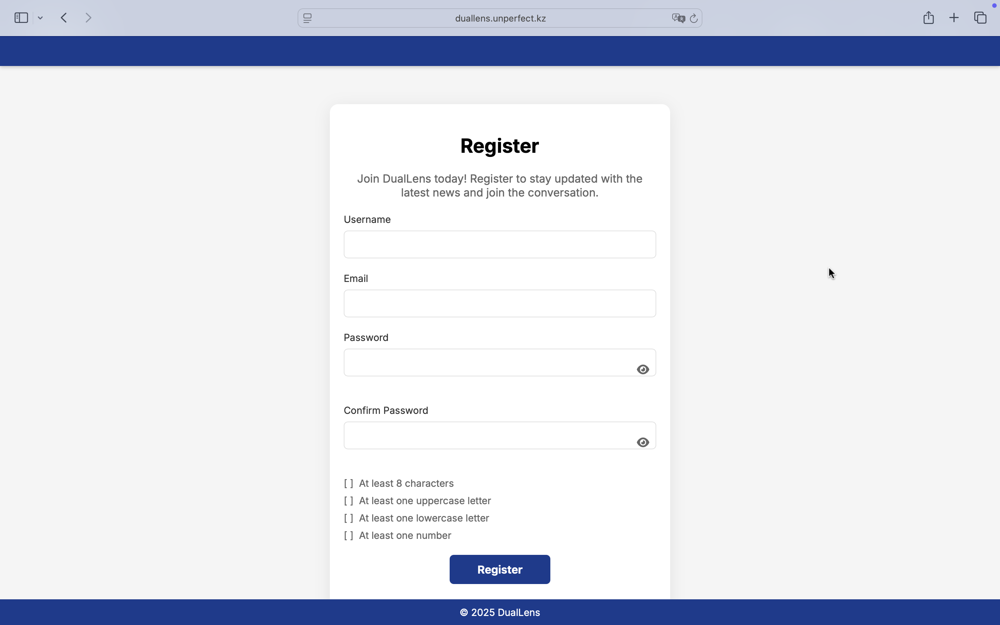
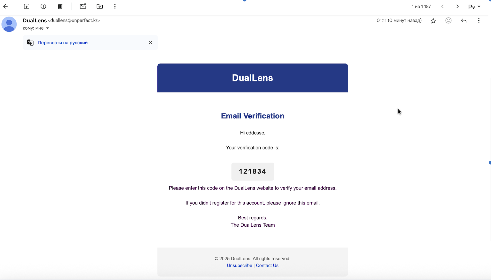
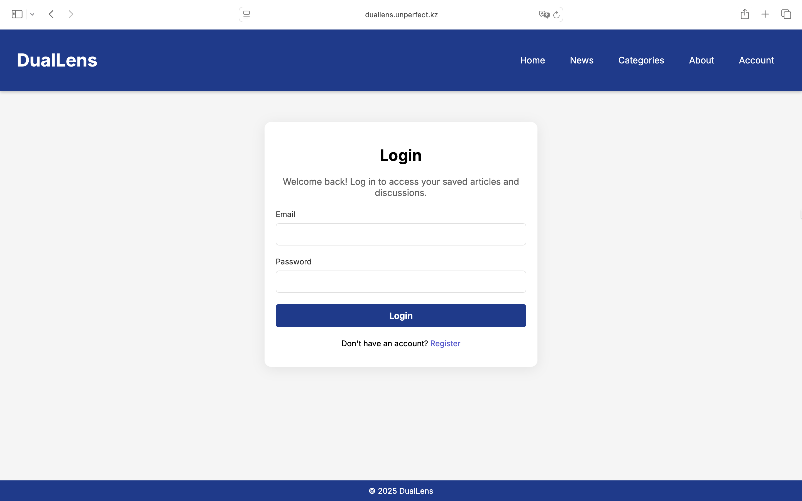
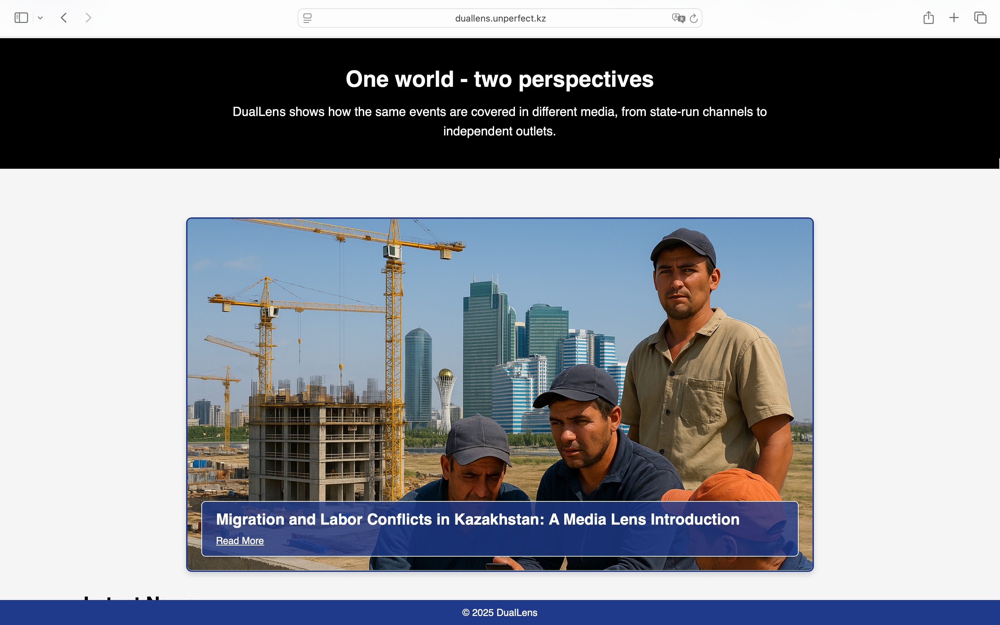
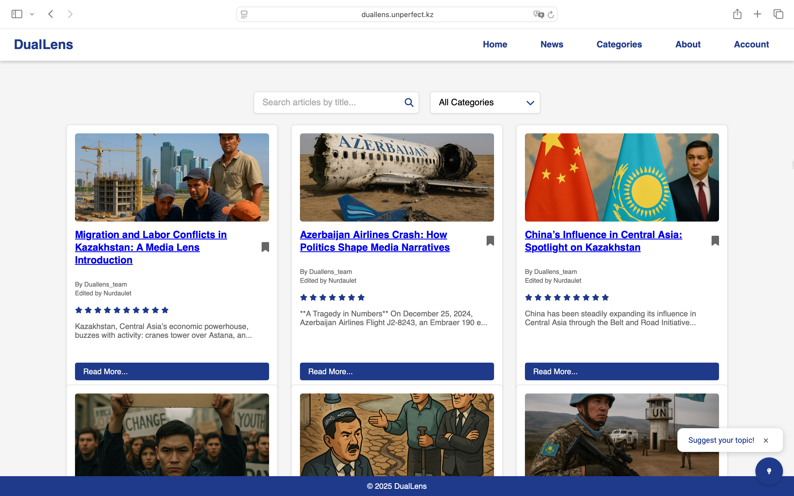
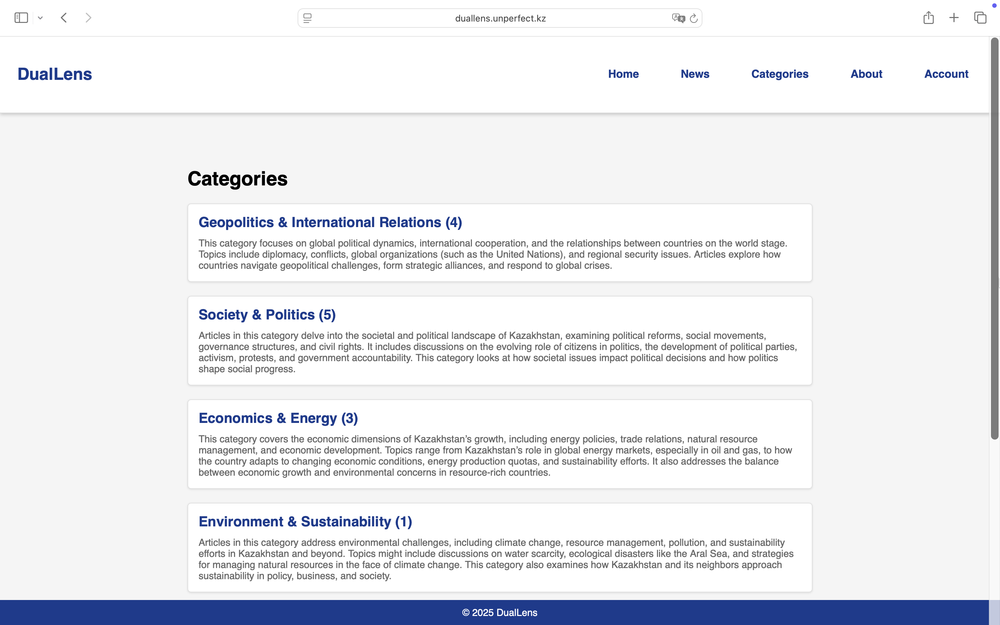
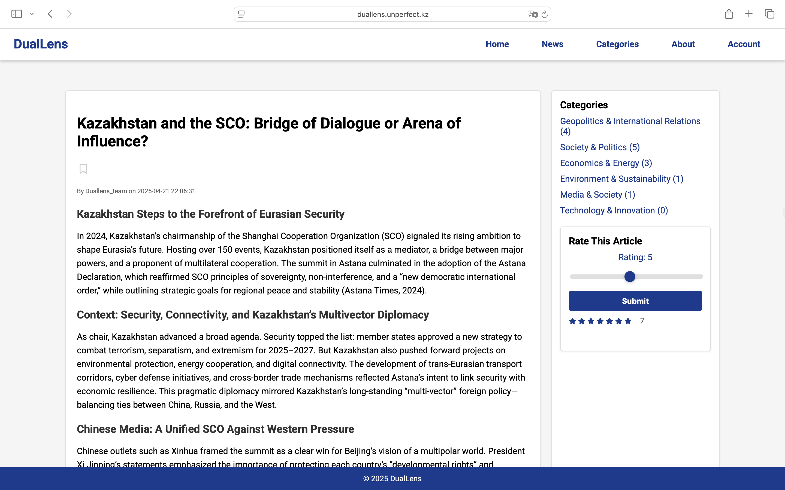
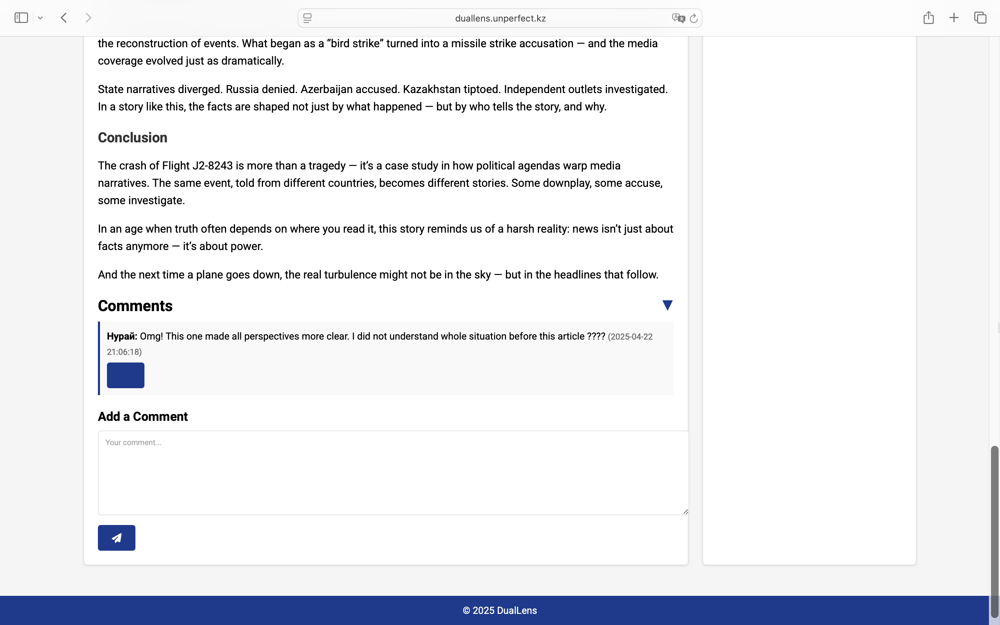
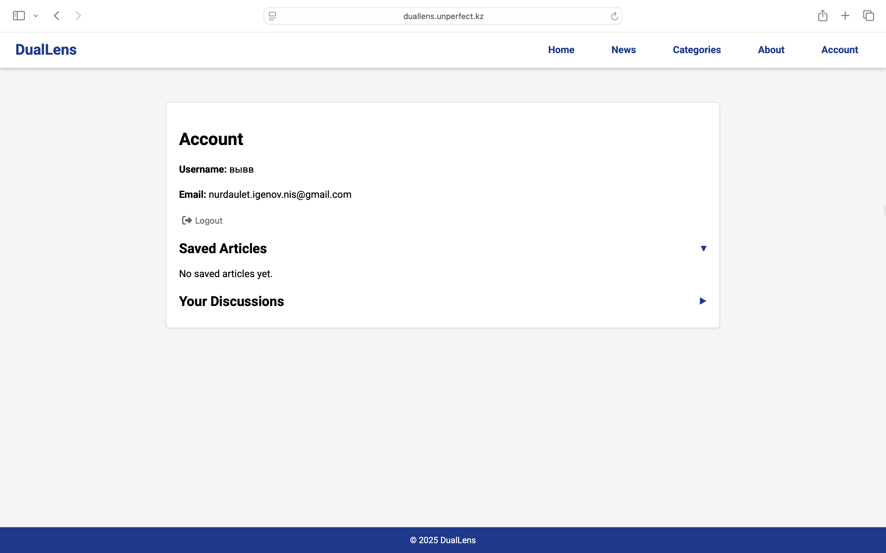

# 🧠 DualLens – AI-Powered Political News Bias Visualizer

**DualLens** is a web platform that visualizes political bias in news articles using natural language processing and GPT-based sentiment analysis. It allows users to critically engage with political content, comment and discuss, and save articles in a personalized dashboard.

The platform was built with a focus on **media ethics**, **transparency**, and **civic education**.

---

## ✨ Features

- 📰 **AI-Powered Bias Analysis**: Automatically detects ideological slant in political news using GPT API.
- 📂 **Article Categories**: Articles are grouped by topic (elections, economy, etc.) for easier exploration.
- 🔍 **Search Functionality**: Instantly find articles by keywords.
- 👤 **User Accounts**: Register, log in, and manage saved articles and comments.
- 📧 **Email Verification**: Upon registration, users receive a verification code via **Brevo** to confirm their identity.
- 💬 **Comment System**: Users can post and reply to comments under each article.
- 💾 **Save Articles**: Users can bookmark articles to read or reference later.
- 🛡️ **Secure Access**: Authentication and account management with session handling.

---

## 🛠️ Tech Stack

- **Frontend**: HTML, CSS, Bootstrap
- **Backend**: PHP
- **AI Integration**: GPT API for sentiment & bias analysis
- **Database**: MySQL
- **Email System**: [Brevo](https://www.brevo.com/) (formerly Sendinblue)

---

## 📸 Screenshots

**🔐 Registration Page – Account Creation**  
Users create accounts by filling out the registration form.  

**📧 Email Verification**  
After registration, users receive a code via Brevo to verify their email.  

**🔓 Login Page**  
Registered users can securely log into their accounts.  

**📰 Index Page – Trending Topics & Latest News**  
Landing page with the most recent and discussed political articles.  

**📚 News Page – Full Article Library**  
Displays all available articles in the system.  

**📂 Categories Page**  
Articles are sorted into relevant political and social categories.  

**🗞️ Article View with AI Bias Analysis**  
Each article includes its full content along with GPT-generated political bias analysis.  

**💬 Comment System**  
Users can leave comments, reply to others, and hold discussions.  

**👤 Account Dashboard**  
Users can manage saved articles and track comment activity.  

---
